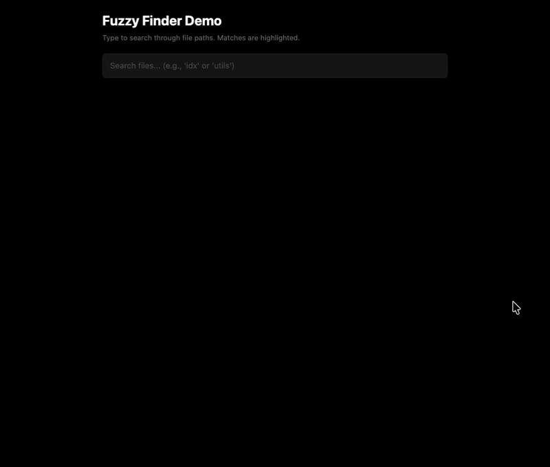

<div align="center">

# Fuzzy Finder

[](https://deno.com) [](https://jsr.io/@neabyte/fuzzy-finder) [](https://www.npmjs.com/package/@neabyte/fuzzy-finder) [](https://github.com/NeaByteLab/Fuzzy-Finder/actions/workflows/ci.yaml) [](LICENSE)

High-performance fuzzy file search with intelligent ranking algorithm


**Zero-dependency** fuzzy matching engine optimized for lightning-fast file path searches. Uses bit-mask pre-filtering and intelligent scoring to deliver sub-millisecond results on massive file lists.

</div>

## Features

- **Bit-Mask Pre-Filtering** - Skip 90%+ of paths using 26-bit character bitmaps
- **Intelligent Scoring** - Boundary, camelCase, and consecutive match bonuses
- **Case-Sensitive Mode** - Auto-detects uppercase queries for precise matching
- **Async Loading** - Chunked indexing for non-blocking large file lists
- **Top-N Optimization** - Maintains sorted results without full sorting overhead
- **Test File Deprioritization** - Auto-lower scores for test/spec files
- **Zero Dependencies** - Pure TypeScript with no external dependencies
- **Universal Runtime** - Works in Deno, Node.js, and browsers via CDN

## Installation

> [!NOTE]
> **Prerequisites:** [Deno](https://deno.com/) 2.0+ or [Node.js](https://nodejs.org/) 22+.

**Deno (JSR)**

```bash
deno add jsr:@neabyte/fuzzy-finder
```

**npm/Node.js**

```bash
npm install @neabyte/fuzzy-finder
```

**CDN (Browser/ESM)**

```typescript
// esm.sh
import FuzzyFinder from 'https://esm.sh/jsr/@neabyte/fuzzy-finder'

// or unpkg (npm mirror)
import FuzzyFinder from 'https://unpkg.com/@neabyte/fuzzy-finder@latest/src/index.ts'
```

## Quick Start



### 1. Import Module

```typescript
// Default import (works in Deno, Node.js, and browsers)
import FuzzyFinder from '@neabyte/fuzzy-finder'

// or named export
import { FuzzyFinder, type SearchResult } from '@neabyte/fuzzy-finder'
```

### 2. Load & Search

```typescript
// Initialize
const finder = new FuzzyFinder()

// Load file paths (sync)
finder.load([
  'src/index.ts',
  'src/utils/helpers.ts',
  'src/components/Button.tsx',
  'tests/index.test.ts'
])

// Search with fuzzy matching
const results = finder.search('idx', 5)
// [{ path: 'src/index.ts', score: 0.98 }, ...]
```

### 3. Async Loading (Large Lists)

```typescript
const finder = new FuzzyFinder()

// Load 100k+ files without blocking UI
const { queryable, done } = finder.loadAsync(massiveFileList)

// Wait for first chunk (queryable)
await queryable

// Search while still indexing
const results = finder.search('component', 10)

// Wait for complete indexing
await done
```

## Search Options

### Include Match Positions

```typescript
const results = finder.search('btn', 5, { includePositions: true })
// [{
//   path: 'src/components/Button.tsx',
//   score: 0.95,
//   positions: [17, 21, 25]  // Character indices of 'b', 't', 'n'
// }]
```

### Case-Sensitive Search

```typescript
// Uppercase in query triggers case-sensitive mode
const results = finder.search('Button', 5) // Case-sensitive
const results = finder.search('button', 5) // Case-insensitive
```

## Build & Test

From the repo root (requires [Deno](https://deno.com/)).

**Check** - format, lint, and typecheck:

```bash
# Format, lint, and typecheck source
deno task check
```

**Test** - run tests:

```bash
# Run tests in tests/
deno task test
```

## Purpose & Usage

Fuzzy Finder implements **bit-mask accelerated fuzzy matching** inspired by command palette search in editors like VS Code and Sublime Text. It pre-filters paths using 26-bit character bitmaps (one bit per a-z letter), skipping paths that cannot possibly match before running the full fuzzy algorithm.

**Common use cases:**

- **Command Palette** - Quick file navigation in code editors
- **IDE Search** - `Ctrl+P` style file jumping
- **CLI Tools** - Fuzzy file picker for terminal applications
- **Large Dataset Filtering** - Search massive file trees efficiently
- **Browser Applications** - Client-side file search via CDN

See [full documentation](docs/README.md) for advanced usage including:

- Custom scoring configuration
- Batch search operations
- Memory optimization strategies
- Browser integration patterns

## Contributing

- **Bugs & ideas** - [GitHub Issues](https://github.com/NeaByteLab/Fuzzy-Finder/issues)
- **Code & docs** - [Pull Requests](https://github.com/NeaByteLab/Fuzzy-Finder/pulls) welcome.
- **Use it** - Try Fuzzy Finder in your projects and share feedback.

## License

This project is licensed under the MIT license. See [LICENSE](LICENSE) for details.
